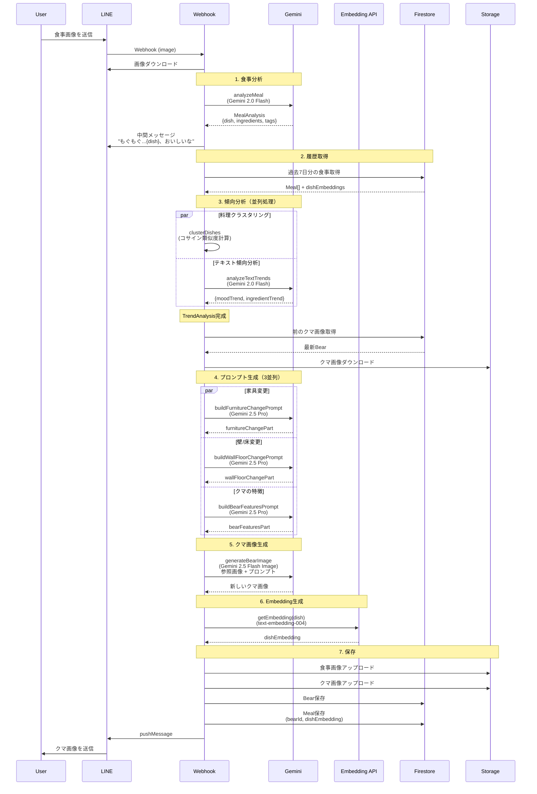
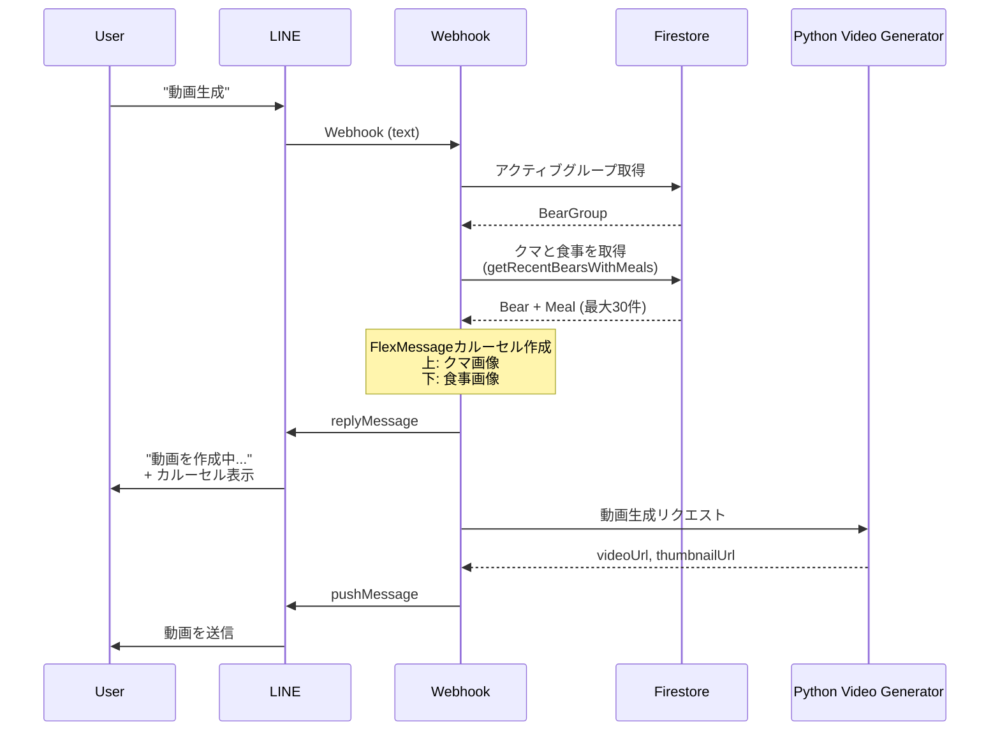
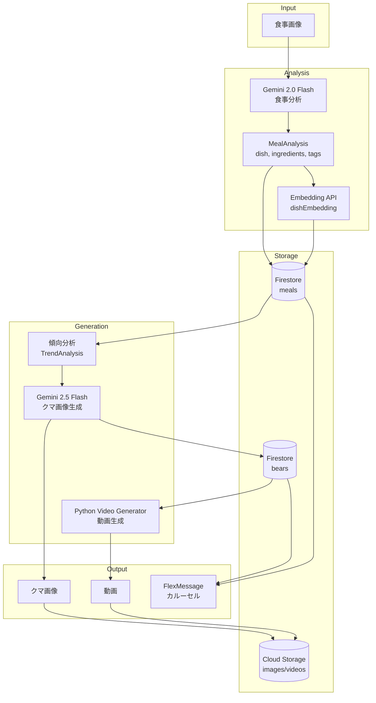

# キロクマ 画像生成仕様

## 概要

食事画像から分析されたデータを元に、クマとお部屋の画像を生成する。
過去7日分の食事履歴から「傾向」を読み取り、部屋のスタイルや家具に反映する。

---

## アーキテクチャ

### 食事記録フロー



### AI処理の詳細

| ステップ | 処理 | モデル | 入力 | 出力 |
|---------|------|--------|------|------|
| 1 | 食事分析 | Gemini 2.0 Flash | 食事画像 | MealAnalysis (dish, ingredients, tags) |
| 3a | 料理クラスタリング | - (計算処理) | dishEmbeddings | DishClusterResult (trendDishes, strength) |
| 3b | テキスト傾向分析 | Gemini 2.0 Flash | tags[], ingredients[] | TextTrendResult (moodTrend, ingredientTrend) |
| 4a | 家具変更プロンプト | Gemini 2.5 Pro | meals[], TrendAnalysis | 家具追加/変更の指示文 |
| 4b | 壁/床変更プロンプト | Gemini 2.5 Pro | meals[], TrendAnalysis | 壁紙/床/装飾の変更指示文 |
| 4c | クマの特徴プロンプト | Gemini 2.5 Pro | todaysMeal | outfit, activity, expression, lighting |
| 5 | クマ画像生成 | Gemini 2.5 Flash Image | 参照画像 + プロンプト | クマ画像 (PNG) |
| 6 | Embedding生成 | text-embedding-004 | dish (料理名) | dishEmbedding (768次元) |

### 動画生成フロー



### データフロー概要



---

## データモデル

### MealAnalysis（1食分の分析結果）

| フィールド | 型 | 説明 | 例 |
|-----------|-----|------|-----|
| dishes | Dish[] | 料理リスト | [{name: "鮭の塩焼き", ...}] |
| tags | string[] | 雰囲気タグ（3-5個） | ["和食", "ほっこり", "家庭的"] |

### Dish（1つの料理）

| フィールド | 型 | 説明 | 例 |
|-----------|-----|------|-----|
| name | string | 料理名 | "鮭の塩焼き" |
| category | "main" \| "side" \| "staple" \| "soup" | カテゴリ | "main" |
| ingredients | string[] | 食材（1-3個） | ["鮭", "塩", "レモン"] |
| portion | "small" \| "medium" \| "large" | 量 | "medium" |

### Meal（Firestore保存データ）

| フィールド | 型 | 説明 |
|-----------|-----|------|
| id | string | ドキュメントID |
| userId | string | ユーザーID |
| groupId | string | 所属するグループID |
| bearId | string | 紐づくクマID |
| analyzedData | MealAnalysis | 分析結果 |
| tagsEmbedding | number[] | タグのEmbedding |
| dishesEmbedding | number[] | 料理名のEmbedding |
| ingredientsEmbedding | number[] | 食材のEmbedding |
| createdAt | Date | 作成日時 |

---

## Embedding & 類似度計算

### 3つのEmbedding

| Embedding | 対象 | 用途（予定） |
|-----------|------|-------------|
| tagsEmbedding | 雰囲気タグ | 部屋の全体スタイル |
| dishesEmbedding | 料理名 | 壁/床のテーマ |
| ingredientsEmbedding | 食材 | 家具のモチーフ |

### 類似度計算

全ペアのコサイン類似度を計算し、高類似度（0.8以上）のペアの割合から傾向を判定:
- **strong**: 60%以上のペアが高類似度
- **medium**: 30%以上
- **weak**: それ以下

---

## トレンド分析

### TrendAnalysis（傾向分析結果）

過去7日分の食事Embeddingから、3つの観点で「偏り」を検出する。

| フィールド | 型 | 説明 |
|-----------|-----|------|
| tags | "strong" \| "medium" \| "weak" | 雰囲気の傾向（ほっこり系が続く等） |
| dishes | "strong" \| "medium" \| "weak" | 料理ジャンルの傾向（和食が続く等） |
| ingredients | "strong" \| "medium" \| "weak" | 食材の傾向（きのこ多め等） |

### 総合傾向の判定

3つの傾向から総合的な強さを判定（壁/床変更に使用）:

| 条件 | 総合傾向 |
|-----|---------|
| 2つ以上が strong | STRONG |
| 1つが strong、または2つ以上が medium | MEDIUM |
| それ以外 | WEAK |

### プロンプトへの反映

#### 家具変更

| 傾向 | 家具デザイン |
|-----|-------------|
| STRONG | 大胆なテーマ家具（きのこスツール、水槽等） |
| MEDIUM | 控えめなテーマアクセント（色・パターン） |
| WEAK | ニュートラル、テーマを強制しない |

#### 壁/床変更

| 総合傾向 | 変更範囲 |
|---------|---------|
| STRONG | 壁紙AND床の両方を変更 |
| MEDIUM | 壁紙OR床のどちらかを変更 |
| WEAK | 壁の装飾のみ変更（時計、絵等） |

---

## 画像生成フロー

### 1. 中間メッセージ送信

食事分析完了後、画像生成前に送信：
```
もぐもぐ...{メイン料理名}、おいしいな🐻
どんなクマになるかな〜
```

### 2. プロンプト生成（3つを並列）

| プロンプト | 入力 | 出力 |
|-----------|------|------|
| 家具変更 | 過去7日分の食事履歴 | Add/Replace指示 |
| 壁/床変更 | 過去7日分の食事履歴 | Wallpaper/Floor/Wall decor指示 |
| クマの特徴 | 今日の食事のみ | Outfit/Activity/Expression/Lighting |

### 3. 差分ベース画像生成

- **参照画像**: 前のクマ画像（初回は空の部屋）
- **部屋**: 参照画像から差分で変更を適用
- **クマ**: 毎回新しく描画（前のクマを無視）

---

## プロンプト設計

### クマのスタイル（固定）

```
Bear Style (MUST FOLLOW):
- Cute stuffed animal / plush toy style young bear
- Round, chubby body with short limbs
- Soft fluffy brown fur with warm tones
- Small solid black eyes (no whites)
- Small cute nose
- Friendly, huggable appearance
```

### 家具変更ルール

```
Growth Rules:
- Few meals (1-2): Add small items only
- Some meals (3-5): Can add small furniture
- Many meals (5-7): Can add medium furniture
- Lots of meals (7+): Can add large furniture

Room Space:
- The room is SMALL - only space for 3-5 items total
- If room is full, REPLACE an old item instead of adding
```

### 壁/床変更ルール

```
Change Rules (based on trend strength):
- STRONG trend (4+ times): Change wallpaper AND floor
- MEDIUM trend (2-3 times): Change wallpaper OR floor
- WEAK trend (no pattern): Only change wall decor
```

### クマの活動

```
Think about:
- What mood does this meal give? (energetic, relaxed, cozy, playful, creative...)
- What activity fits that mood? (anything the bear can do in a small room)

CRITICAL: Bear should NOT be eating or cooking. Choose ONE simple activity.
```

---

## 処理フロー詳細

```
1. 画像受信
2. 食事分析 (analyzeMeal)
   - 食べ物でない場合 → NotFoodError → エラーメッセージ返信
3. 中間メッセージ送信 (replyMessage)
4. グループ・履歴取得
5. 3つのEmbedding計算（並列）
6. プロンプト生成（3つ並列）
7. 画像生成 (Gemini 2.5 Flash Image)
8. 画像アップロード
9. クマ・食事をDB保存
10. クマ画像送信 (pushMessage)
```

---

## 実装済み

- [x] Embeddingを活用した類似度ベースの傾向検出
- [x] 傾向の強さに応じた家具/壁/床の変更ロジック
- [x] 食材モチーフの家具生成（きのこランプ等）